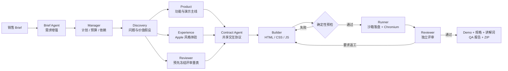

<div align="center">

# DemoPilot

### 把一段客户需求，变成一套可以讲、可以点、可以交付的销售 Demo

由 9 个协作节点完成需求增强、产品设计、交互契约、代码生成、浏览器验证与独立评审。

[](https://www.python.org/)
[](https://fastapi.tiangolo.com/)
[](https://vuejs.org/)
[](https://www.typescriptlang.org/)
[](https://docs.astral.sh/uv/)
[](https://www.deepseek.com/)

[快速开始](#快速开始) · [核心能力](#核心能力) · [运行架构](#运行架构) · [评测证据](#评测证据) · [API](#api) · [项目边界](#项目边界)

</div>

## 为什么是 DemoPilot

普通的一次性代码生成容易把“页面看起来完成了”误当成“需求真的实现了”。DemoPilot 把生成过程改造成一条可验证的 Agent Team 流水线：Builder 负责构建，但不能自己定义验收标准，也不能用自报结果证明完成；Contract Agent、Runner 与 Reviewer 分别冻结交互协议、执行真实浏览器验证、给出独立结论。

| 一次性生成 | DemoPilot |
| --- | --- |
| Prompt 直接变代码 | 先增强 Brief，再拆解、设计、冻结契约后构建 |
| 生成者同时解释自己是否完成 | Builder、Runner、Reviewer 职责与权限隔离 |
| 测试选择器可能跟着页面一起“编出来” | Harness 分配并冻结 `#contract-*` 选择器与协议 SHA-256 |
| 失败后整段重做 | 精确记录证据、根因、修复指令与复验方法，定向返工 |
| 成功依赖一次演示 | 固定用例、版本对比、A/B 晋级门持续回归 |
| 产物来源不清楚 | 每次真实工具调用记录路径、耗时、结果与 SHA-256 |

> [!IMPORTANT]
> DemoPilot 生成的是**纯展示型售前 Demo**。业务数据为本地虚构样例，不连接 ERP、WMS、CRM、客户数据库或生产环境，也不会自动发布或发送给客户。

## 核心能力

- **9 节点 Agent Team**：Brief、Manager、Discovery、Product、Experience、Contract、Builder、Runner、Reviewer 分工协作。
- **共享交互契约**：每项 must-have 被转换为稳定操作路径、选择器与可见断言，返工期间不得修改验收标准。
- **Builder 确定性预检**：每一版代码在落盘前检查文件范围、安全、HTML 结构、契约选择器、控件类型、断言文本和数据契约。
- **真实浏览器验证**：Playwright + Chromium 执行页面加载、导航、按钮点击、状态变化与控制台错误检查，并保存截图证据。
- **独立 Reviewer**：只读取需求、最终项目和运行证据，不修改文件，也不接受 Builder 自报完成。
- **受控执行 Harness**：任务级沙箱、生命周期 Hook、审批、取消/恢复、最大调用数、最大返工轮次和 SSE 实时事件流。
- **自动评测中心**：20 条固定跨行业用例，跟踪成功率、质量分、浏览器通过率、功能覆盖率、调用数和耗时。
- **Skill A/B 晋级**：六个小型工程 Skill 只有通过同 Provider、同用例、同停止条件的 A/B 门槛后，才进入正式 Harness。

## 运行架构



### 关键设计

1. **验收标准先于代码**：Product、Experience 与 Reviewer 完成后，Contract Agent 生成业务操作路径，Harness 再分配稳定选择器并冻结协议。
2. **客观门禁先于主观评审**：文件缺失、危险代码、契约违约等问题由预检硬阻断；视觉审美、文案质量和销售说服力由 Reviewer 与销售人工判断。
3. **证据先于结论**：只有文件真实落盘、校验和生成、浏览器交互完成后才创建 receipt；模型文本不能替代运行证据。
4. **失败可恢复**：运行状态、Agent 输出、审批和评测批次持久化到本地 JSON；任务可取消，并从检查点恢复。

## 快速开始

### 前置条件

- Python 3.11+
- [uv](https://docs.astral.sh/uv/getting-started/installation/)
- Node.js 20+ 与 npm

### 1. 获取项目

```powershell
git clone https://github.com/zhhhhhhhy/DemoPolit.git
cd DemoPolit
Copy-Item .env.example .env
```

### 2. 安装依赖

```powershell
cd backend
uv sync --extra dev
uv run playwright install chromium

cd ../frontend
npm.cmd install
cd ..
```

### 3. 配置 Provider

DeepSeek 是真实开发的默认 Provider。把下面配置加入项目根目录 `.env`：

```dotenv
DEEPSEEK_API_KEY=your_deepseek_api_key
DEEPSEEK_BASE_URL=https://api.deepseek.com
DEEPSEEK_MODEL=deepseek-v4-flash
```

没有 API Key 也可以启动项目，并在界面中选择 **Mock** 完成确定性的离线全流程回归。Mock 会明确标记为 `controlled_template_fallback`，不会冒充真实模型生成。

可选 Provider 还支持同样格式的 `AIHUBMIX_*` 与 `ZJU_*` 配置。Claude 默认禁用；如需启用，只使用 Anthropic 官方 SDK，详见[可选：Claude 官方 SDK](#可选claude-官方-sdk)。

### 4. 启动

```powershell
.\start.ps1
```

打开：

- Web 控制台：<http://127.0.0.1:5173>
- API 健康检查：<http://127.0.0.1:8091/api/health>
- OpenAPI 文档：<http://127.0.0.1:8091/docs>

也可以分别启动两个服务：

```powershell
# 终端 1
cd backend
uv run uvicorn --env-file ../.env --app-dir src demopilot.main:app --reload --host 127.0.0.1 --port 8091

# 终端 2
cd frontend
npm.cmd run dev
```

## 使用方式

1. 填写客户名称、行业、演示对象、客户场景和必须出现的能力。
2. 选择 DeepSeek 进行真实生成，或选择 Mock 进行离线回归。
3. 需要时开启“生成文件前人工批准”；团队会在首次写入产物前暂停。
4. 在 Agent Team 时间线中查看每个节点、工具凭证、预检失败和返工轨迹。
5. 预览最终 Demo，检查独立 Reviewer 报告，下载完整 ZIP 交付包。

最终交付包包含：

```text
demo/
├── index.html
├── styles.css
└── app.js
demo-spec.md
sales-script.md
qa-report.md
manifest.json
```

## 评测证据

### 工程验证

当前仓库快照已完成以下本地验证：

| 检查项 | 结果 |
| --- | --- |
| Backend Ruff | 通过 |
| Backend pytest | 35 tests passed |
| Frontend ESLint | 通过 |
| Frontend Vitest | 3 tests passed |
| Frontend production build | 通过 |

复现命令：

```powershell
cd backend
uv run ruff check .
uv run pytest --basetemp=.pytest-tmp

cd ../frontend
npm.cmd run lint
npm.cmd run test:run
npm.cmd run build
```

### 真实 DeepSeek 复杂任务

运行 `a50e398debcb` 使用真实 DeepSeek 完成复杂零售 Demo：前三个 Builder 版本因缺失冻结契约选择器被预检提前阻断，第 3 次修订进入 Chromium 与 Reviewer 阶段，最终浏览器通过、Reviewer 100 分、质量门通过，共 12 次模型调用、3 次修订。

这证明了“真实 Provider → Agent Team → 预检 → 产物落盘 → Chromium → Reviewer → 返工”的链路可运行；它不代表模型在所有行业和需求上都能达到相同质量。

### Builder 预检探索性 A/B

| 指标 | 关闭预检 | 开启预检 | 变化 |
| --- | ---: | ---: | ---: |
| 最终成功率 | 0% | 33.3% | +33.3pp |
| 平均质量分 | 19.00 | 32.42 | +13.42 |
| 平均模型调用 | 17.00 | 12.67 | -4.33 |
| 平均耗时 | 285.81s | 181.50s | -104.31s |
| 记录的功能覆盖率 | 100% | 33.3% | -66.7pp |

这是 3 条用例的小样本探索，不是统计证明。开启预检的两个失败用例在产物生成前就被阻断，因此现有评测器没有最终产物可计算覆盖率。当前结论仅限于：预检减少了无效浏览器/Reviewer 工作，并给出初步的最终质量正向信号；尚未证明首轮质量稳定提升。

完整实验记录：

- [Builder 确定性预检报告](BUILDER_PREFLIGHT_REPORT.md)
- [共享交互契约报告](SHARED_CONTRACT_REPORT.md)
- [工程 Skill A/B 报告](SKILL_AB_REPORT.md)

## 自动评测中心

评测中心内置 20 条固定用例，覆盖运营、销售、客服、制造、零售、金融、人力、物流、教育、医疗、能源、物业、法务、营销、采购、安全、项目管理、知识库、电商和经营驾驶舱。

- **Mock**：支持 5 / 10 / 20 条离线回归。
- **真实 Provider**：DeepSeek、AIHubMix、ZJU 一次最多 3 条并强制串行，限制误触发成本。
- **可追溯结果**：保存 Demo 任务 ID、输入摘要、来源模式、验证结果、浏览器证据、调用数、返工次数和耗时。
- **版本比较**：对比相同 Provider 的上一版本，并输出 Markdown 报告。
- **Skill 晋级**：`baseline`、`candidate`、`approved` 三种配置支持首轮质量 A/B；未通过门槛的候选不会进入正式 Harness。

## API

### Demo 运行

| Method | Endpoint | 说明 |
| --- | --- | --- |
| `POST` | `/api/runs` | 创建 Demo 任务 |
| `GET` | `/api/runs/{id}` | 获取完整任务快照 |
| `GET` | `/api/runs/{id}/events` | SSE 推送进度、审批和工具凭证 |
| `POST` | `/api/runs/{id}/approvals/{approval_id}` | 提交 `approve` / `decline` |
| `POST` | `/api/runs/{id}/cancel` | 取消任务并保留已有证据 |
| `POST` | `/api/runs/{id}/resume` | 从持久化检查点恢复 |
| `GET` | `/api/runs/{id}/files/{path}` | 读取或下载交付文件 |

### 自动评测

| Method | Endpoint | 说明 |
| --- | --- | --- |
| `GET` | `/api/evaluation-cases` | 获取固定评测集 |
| `POST` | `/api/evaluations` | 创建批量评测 |
| `GET` | `/api/evaluations` | 获取评测历史 |
| `GET` | `/api/evaluations/{id}` | 获取批次明细 |
| `GET` | `/api/evaluations/{id}/events` | SSE 推送批次进度 |
| `POST` | `/api/evaluations/{id}/cancel` | 取消批次 |
| `GET` | `/api/evaluations/{id}/report` | 下载 Markdown 报告 |

## 项目结构

```text
DemoPilot/
├── backend/
│   ├── src/demopilot/
│   │   ├── providers/          # DeepSeek / Mock / 可选 Provider
│   │   ├── skills/             # 六个小型工程 Skill
│   │   ├── orchestrator.py     # Agent Team 编排与返工循环
│   │   ├── interaction_contract.py
│   │   ├── builder_preflight.py
│   │   ├── browser_qa.py
│   │   ├── reviewer.py
│   │   └── evaluator.py
│   ├── tests/
│   └── pyproject.toml
├── frontend/
│   ├── src/components/
│   └── package.json
├── scripts/                    # Skill 校验与 A/B 工具
├── .env.example
└── start.ps1
```

## 配置

| 环境变量 | 默认值 | 用途 |
| --- | --- | --- |
| `DEMOPILOT_MAX_AGENT_CALLS` | `18` | 单任务最大模型调用数 |
| `DEMOPILOT_MAX_REVISIONS` | `4` | 最大返工轮次 |
| `DEMOPILOT_MAX_PARALLEL_AGENTS` | `2` | 最大并行 Agent 数 |
| `DEMOPILOT_ENABLE_CLAUDE` | `false` | 是否启用 Claude 官方 SDK |
| `DEEPSEEK_API_KEY` | 空 | DeepSeek API 密钥 |
| `DEEPSEEK_BASE_URL` | `https://api.deepseek.com` | DeepSeek API 地址 |
| `DEEPSEEK_MODEL` | `deepseek-v4-flash` | DeepSeek 模型名 |
| `VITE_API_BASE` | 空 | 前端 API 地址；开发代理模式保持为空 |

> [!CAUTION]
> 不要提交 `.env`、API Key、`.data` 运行记录或客户信息。项目已通过 `.gitignore` 排除这些内容，但提交前仍应人工检查 `git status`。

## 可选：Claude 官方 SDK

本项目不包含、也不依赖任何泄露或未经授权的 Claude Code 源码。Claude 模式只使用 Anthropic 官方 Python SDK，并将执行能力限制为结构化规划；默认禁用 Bash、Read、Write、Edit 与网络工具。

```powershell
cd backend
uv sync --extra dev --extra claude
$env:DEMOPILOT_ENABLE_CLAUDE = "true"
uv run uvicorn --env-file ../.env --app-dir src demopilot.main:app --host 127.0.0.1 --port 8091
```

## 项目边界

- Mock 是确定性的受控基线，不代表真实大模型效果。
- 20 条固定用例用于工程回归，不是客户真实数据集；3 条 DeepSeek A/B 不能代表模型总体质量。
- Builder 只生成 `index.html`、`styles.css`、`app.js`，沙箱不开放 Bash、任意文件读写、包安装或外部网络。
- Chromium E2E 证明受控页面在当前环境可加载和点击，不等于完成跨浏览器、无障碍、性能、部署或生产验收。
- 本地 JSON 适合单机 MVP；多实例与多租户部署仍需要数据库、对象存储、任务队列、权限与租户隔离。
- 最终 Demo 必须由销售复核业务正确性、视觉质量与客户表达，不会自动对外发布。

## Roadmap

- [x] 9 节点 Agent Team 与受限返工循环
- [x] Contract Agent 与 Harness 冻结交互协议
- [x] Builder 确定性预检与 Chromium 质量门
- [x] 独立 Reviewer 与证据化 QA 报告
- [x] 20 用例自动评测中心与 Skill A/B 晋级
- [ ] PostgreSQL / 对象存储 / 任务队列适配
- [ ] 多租户、RBAC 与审计后台
- [ ] 跨浏览器、无障碍与性能基线
- [ ] 容器化部署与 CI 回归

## Contributing

欢迎提交 Issue、评测用例、失败样本和 Pull Request。建议在 PR 中说明：

1. 要解决的真实失败是什么；
2. 修改影响哪些 Agent、契约或门禁；
3. 如何复现以及新增了哪些自动化证据；
4. 是否改变 Provider 成本、安全边界或产物格式。

新增工程 Skill 请先放入 `candidate` 配置，并通过同 Provider、同用例、同首轮停止条件的 A/B 晋级门；不要直接加入 `approved`。

## Acknowledgements

- [Anthropic Claude Agent SDK for Python](https://github.com/anthropics/claude-agent-sdk-python)：可选的官方 Claude Provider。
- [OpenHands Software Agent SDK](https://github.com/OpenHands/software-agent-sdk)：公开的 Agent 沙箱与执行器设计参考。

DemoPilot 只吸收公开可描述的 Agent 工作流与工程方法，未复制、打包或依赖第三方复原版 Claude Code 源码。
